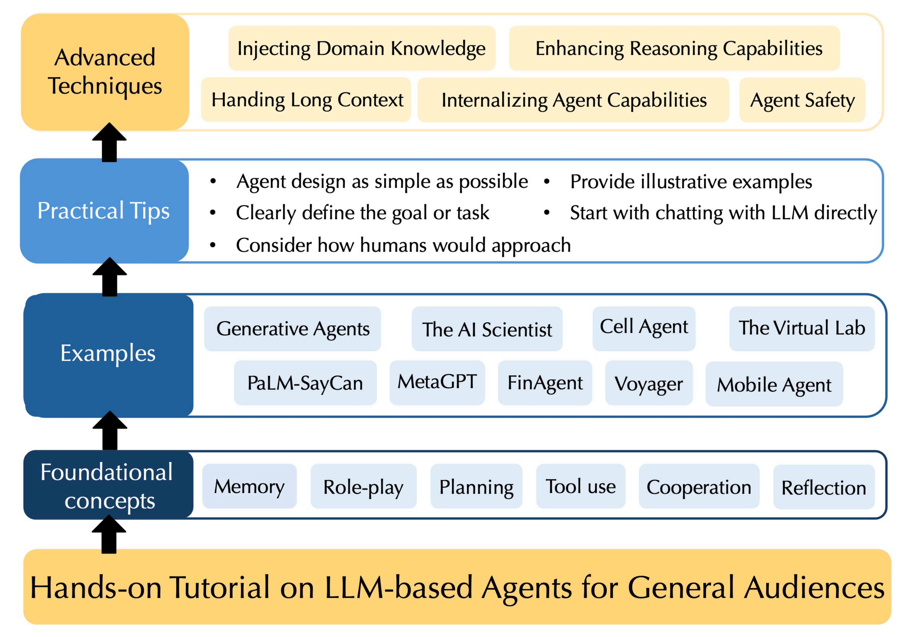

# Our Recent Research about LLMs
<!-- ### 目录
- LLM Routing
  - [The Avengers: A Simple Recipe for Uniting Smaller Language Models to Challenge Proprietary Giants](#the-avengers)
  - [Beyond GPT-5: Making LLMs Cheaper and Better via Performance-Efficiency Optimized Routing](#beyond-gpt-5)
  - [ICL-Router: In-Context Learned Model Representations for LLM Routing](#icl-router)
  - [Learning Compact Representations of LLM Abilities via Item Response Theory](#learning-compact-representations)
- Multi-LLM-based Agent Cooperation/Coordination
  - [Adaptive Theory of Mind for LLM-Based Multi-Agent Coordination](#adaptive-theory-of-mind)
  - [Beyond the Tragedy of the Commons: Building a Reputation System for Generative Multi-Agent Systems](#beyond-the-tragedy)
  - [Emergence of Social Norms in Generative Agent Societies: Principles and Architecture](#emergence-of-social-norms)
- Others
  - [ReMA: Learning to Meta-Think for LLMs with Multi-Agent Reinforcement Learning](#rema-learning-to-meta-think)
  - [Nature-Inspired Population-Based Evolution of Large Language Models](#nature-inspired-population-based-evolution) -->

## News & Updates

🎉 Our LLM agent tutorial website is now live and open to everyone!

Our site offers a beginner-friendly, no-code introduction to LLM agents, with intuitive explanations, 9 self-contained real-world examples, practical development tips, and a roadmap to advanced techniques. [[Paper](https://d197for5662m48.cloudfront.net/documents/publicationstatus/291830/preprint_pdf/e6758438abb84326291f86d79e558057.pdf)] [[Website](https://llm-agent-tutorial.github.io/website/)]

  

Below we list our recent work across different directions in multi-LLM research:

## LLM Routing

- **Avengers**: "The Avengers: A Simple Recipe for Uniting Smaller Language Models to Challenge Proprietary Giants", *AAAI 2026 (Oral)*. [[Paper](https://arxiv.org/abs/2505.19797)] [[Code](https://github.com/ZhangYiqun018/Avengers)]
- **AvengersPro**: "Beyond GPT-5: Making LLMs Cheaper and Better via Performance-Efficiency Optimized Routing", *DAI 2025 (🏆 Best Paper Award)*. [[Paper](https://arxiv.org/abs/2508.12631)] [[Code](https://github.com/ZhangYiqun018/AvengersPro)]
- **ICL-Router**: "ICL-Router: In-Context Learned Model Representations for LLM Routing", *AAAI 2026*. [[Paper](https://arxiv.org/abs/2510.09719)] [[Code](https://github.com/lalalamdbf/ICL-Router)]
- **IrtNet**: "Learning Compact Representations of LLM Abilities via Item Response Theory", *arXiv, Oct 2025*. [[Paper](https://arxiv.org/abs/2510.00844)] [[Code](https://github.com/JianhaoChen-nju/IrtNet)]
- **OpenRouterBench**: "A One-Stop Benchmark and Solution Suite for LLM Routing". [✨ The paper is cooming soon][[Code](https://github.com/ynulihao/OpenRouterBench)]

## LLM-based Multi-Agent Cooperation/Coordination

- **A-ToM**: "Adaptive Theory of Mind for LLM-Based Multi-Agent Coordination", *AAAI 2026*. [[Code](https://github.com/ChunjiangMonkey/Adaptive-ToM)]
- **RepuNet**: "Beyond the Tragedy of the Commons: Building a Reputation System for Generative Multi-Agent Systems", *arXiv, May 2025*. [[Paper](https://arxiv.org/abs/2505.05029)] [[Code](https://github.com/RGB-0000FF/RepuNet)]
- **CRSEC**: "Emergence of Social Norms in Generative Agent Societies: Principles and Architecture", *IJCAI 2024*. [[Paper](https://www.ijcai.org/proceedings/2024/0874.pdf)] [[Code](https://github.com/sxswz213/CRSEC)]

## Others

- **ReMA**: "ReMA: Learning to Meta-Think for LLMs with Multi-Agent Reinforcement Learning", *NeurIPS 2025*. [[Paper](https://arxiv.org/abs/2503.09501)] [[Code](https://github.com/ziyuwan/ReMA-public)]
- **NGENOME+**: "Nature-Inspired Population-Based Evolution of Large Language Models", *arXiv, Mar 2025*. [[Paper](https://arxiv.org/abs/2503.01155)] [[Code](https://github.com/ZhangYiqun018/GENOME)]
